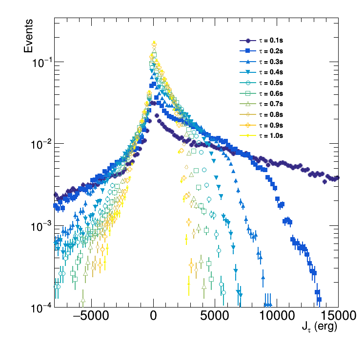

# Simple simulation of the Fluctuation Theorem #

### My project in experimental physics course in sophomore year ###

Reference paper : [Fluctuation theorem for a single particle in a moving billiard: Experiments and simulations](https://journals.aps.org/pre/abstract/10.1103/PhysRevE.76.021115)

My final report : [FinalReport.pdf](https://github.com/hrjheng/Fluctuation-Theorem/blob/master/FinalReport.pdf)

